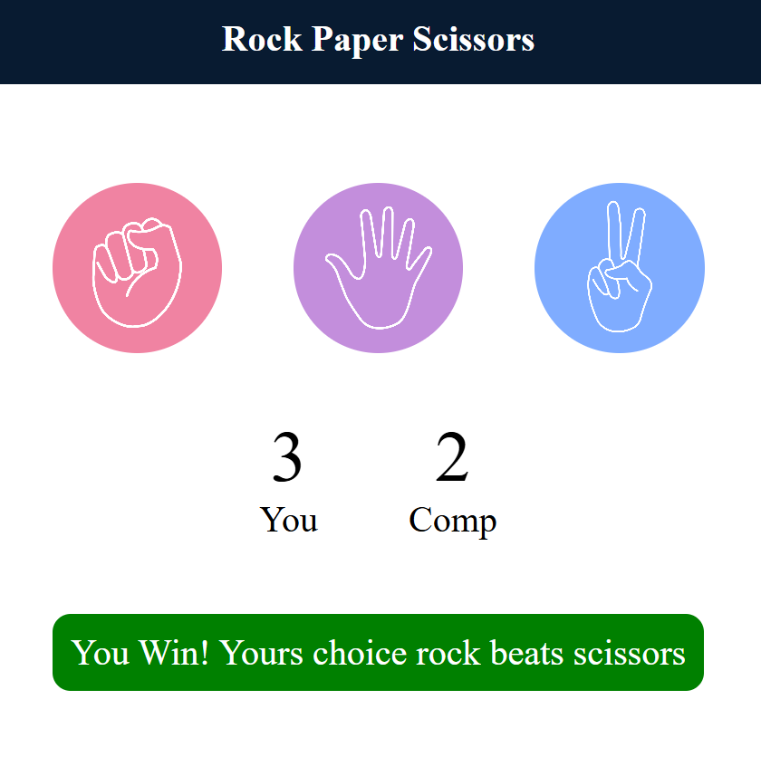

# Rock Paper Scissors Game 🎮

A simple **Rock Paper Scissors web game** built using **HTML, CSS, and JavaScript**.
The player competes against the computer, and the winner is determined based on classic game rules.


## 📌 Features

* Interactive UI with clickable options
* Random computer choice generation
* Real-time score tracking
* Instant result display (Win / Lose / Draw)
* Simple and clean design
* Beginner-friendly JavaScript project

---

## 🛠️ Technologies Used

* HTML5
* CSS3
* JavaScript (Vanilla JS)

---

## 🎯 How the Game Works

1. The player selects **Rock**, **Paper**, or **Scissors**.
2. The computer randomly selects one option.
3. The game compares both choices.
4. The winner is determined based on the rules:

* Rock beats Scissors
* Scissors beats Paper
* Paper beats Rock

If both selections are the same, the round results in a **draw**.


---
## Game Screenshot


## 📂 Project Structure

```
rock-paper-scissors
│
├── index.html
├── style.css
├── script.js
└── README.md
```

---

## ▶️ How to Run the Project

1. Clone the repository

```
git clone https://github.com/yourusername/rock-paper-scissors.git
```

2. Open the project folder.

3. Run **index.html** in your browser.

---

## 💡 Future Improvements

* Add animations for selections
* Add sound effects
* Add multiple rounds / tournament mode
* Improve UI responsiveness
* Add mobile-friendly design

---

## 👨‍💻 Author

**Deep**
AI & Machine Learning Student

---

⭐ If you like this project, consider giving it a star!
